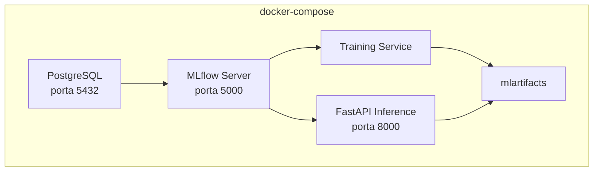
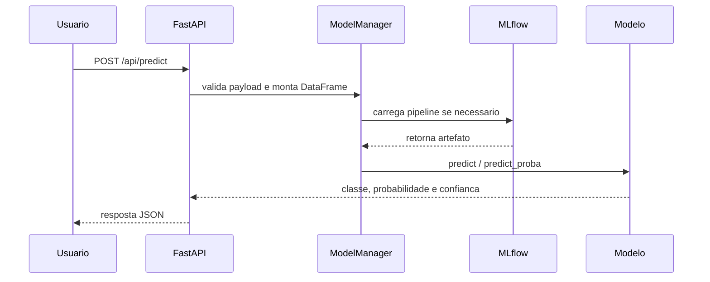

# Tech Challenge - Telco Churn Prediction

Este projeto implementa uma solucao de Machine Learning Engineering para prever churn de clientes de telecomunicacoes. Ele cobre ciencia de dados, fundamentos de software, API, testes, MLflow e Docker.

## Objetivo

Construir uma solucao fim a fim para identificar clientes com maior risco de cancelamento e apoiar acoes de retencao.

## Entregaveis

| Entregavel | Local | Descricao |
| --- | --- | --- |
| ML Canvas | `docs/ml_canvas.md` | Contexto de negocio, stakeholders, proposta de valor e metricas. |
| EDA | `notebooks/01_eda_and_ml_canvas.ipynb`, `docs/RELATORIO_EDA.md` | Analise exploratoria, qualidade dos dados e principais insights de churn. |
| Dataset processado | `data/processed/telco_churn_processed.csv` | Base limpa para treino dos modelos. |
| Experimento controlado | `notebooks/02_experimento_controlado.ipynb` | Comparacao entre baselines, Logistic Regression, Random Forest, XGBoost e MLP. |
| Modelo treinado | `src/models/`, `mlruns/`, `mlartifacts/` | Pipeline, metricas e artefatos registrados no MLflow. |
| Model Card | `docs/MODEL_CARD.md` | Descricao tecnica do modelo, metricas, limitacoes e vieses. |
| API de inferencia | `src/api/` | FastAPI com predicao individual, predicao em lote, health check e model info. |
| Testes | `tests/` | Testes automatizados da API, dados, metricas e treinamento. |
| Docker | `docker-compose.yml`, `Dockerfile.*` | Orquestracao da API, treinamento, MLflow e PostgreSQL. |
| Documentacao operacional | `docs/ARQUITETURA_DEPLOY.md`, `docs/PLANO_MONITORAMENTO.md`, `docs/TERRAFORM_AWS_PLAN.md` | Deploy, monitoramento e plano de infraestrutura. |
| Video STAR | A definir | Placeholder para o link do video de apresentacao no formato STAR. |
| Deploy em AWS | A definir | Placeholder para a URL do deploy em nuvem quando o ambiente estiver publicado. |

## Arquitetura do Projeto


## Arquitetura Docker



## Fluxo de Predicao



## Estrutura

```text
tech_challenge/
  data/          dados brutos e processados
  docs/          documentacao de negocio, modelo, deploy e monitoramento
  notebooks/     EDA, ML Canvas e experimentos
  src/api/       API FastAPI
  src/data/      carga e preparacao de dados
  src/evaluation/ metricas
  src/models/    baselines, treinamento e artefatos
  tests/         testes automatizados
```

## API

| Metodo | Endpoint | Uso |
| --- | --- | --- |
| GET | `/api/health` | Verifica saude da API e carregamento do modelo. |
| POST | `/api/predict` | Predicao para um cliente. |
| POST | `/api/predict-batch` | Predicoes em lote. |
| GET | `/api/model-info` | Informacoes do modelo carregado. |
| POST | `/api/schedule-update` | Agenda atualizacao do modelo. |
| GET | `/api/docs` | Swagger UI. |

## Como Executar

```bash
docker-compose up -d
docker-compose run --rm training
pytest -q
```

Servicos locais:

```text
API: http://localhost:8000/api/docs
Health check: http://localhost:8000/api/health
MLflow: http://localhost:5000
PostgreSQL: localhost:5432
```

## Entrega Final

| Item | Status | Link |
| --- | --- | --- |
| Video STAR | Pendente | `TODO: adicionar link do video STAR` |
| Deploy em AWS | Pendente | `TODO: adicionar URL publica da API na AWS` |

Atalhos uteis:

```bash
make docker-compose-up
make docker-train
make test-cov
make mlflow-ui
```

## Documentacao Complementar

- `docs/RELATORIO_EDA.md`: relatorio da exploracao de dados.
- `docs/MODEL_CARD.md`: detalhes do modelo selecionado.
- `docs/DICIONARIO_DADOS.md`: descricao das variaveis.
- `docs/ARQUITETURA_DEPLOY.md`: arquitetura proposta de deploy.
- `docs/PLANO_MONITORAMENTO.md`: monitoramento e alertas.
- `docs/TERRAFORM_AWS_PLAN.md`: plano de infraestrutura AWS.
- `DOCKER_GUIA_EXECUCAO.md`: guia para execucao com Docker.
