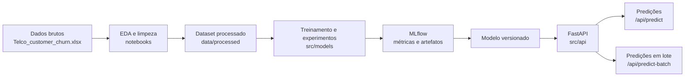
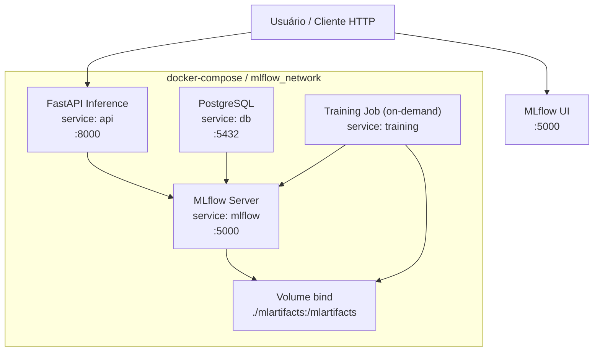
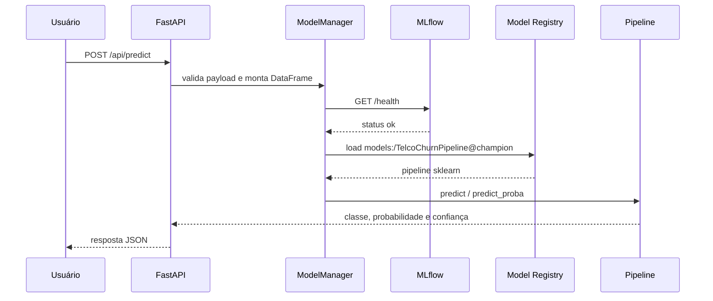

# Tech Challenge - Telco Churn Prediction

Este projeto implementa uma solução de Machine Learning Engineering para prever churn de clientes de telecomunicações.

## Linguagens e Tecnologias

| Categoria | Stack |
| --- | --- |
| Linguagem principal | Python |
| API | FastAPI |
| Machine Learning | scikit-learn, XGBoost, MLP |
| Experiment tracking | MLflow |
| Testes | pytest |
| Containers | Docker, Docker Compose |
| Banco para tracking | PostgreSQL |

## Problema de Negócio

Empresas de telecomunicações sofrem com churn (cancelamento de clientes), o que impacta receita recorrente e aumenta o custo de aquisição de novos clientes.
O desafio de negócio deste projeto é identificar clientes com maior risco de cancelamento para priorizar ações de retenção mais eficientes.

## Dados

Os dados utilizados neste projeto foram retirados do Kaggle, no dataset **Telco Customer Churn**:

- Kaggle: [blastchar/telco-customer-churn](https://www.kaggle.com/datasets/blastchar/telco-customer-churn)
- Referência do dicionário de dados: [docs/DICIONARIO_DADOS.md](docs/DICIONARIO_DADOS.md)

## Objetivo do Projeto

Construir uma solução fim a fim para prever churn e apoiar decisões de negócio orientadas por dados.

## Resumo do Modelo e Impacto Financeiro

Modelo recomendado no experimento controlado: **LogisticRegression-balanced**.

Métricas do modelo recomendado (threshold padrão 0.5):

- ROC-AUC: `0.8482`
- PR-AUC: `0.6444`
- F1-score: `0.6164`
- Recall: `0.7754`
- Precision: `0.5115`

Resultado de negócio no threshold otimizado:

- Threshold recomendado: `0.15`
- Net Benefit máximo: **$706,000**
- Recall no threshold recomendado: **98.40%**
- Precision no threshold recomendado: **38.02%**
- Confusão no threshold recomendado: `TP=368`, `FP=600`, `FN=6`

Premissas de custo usadas no notebook `02_experimento_controlado.ipynb`:

- `cost_fp = $50`
- `cost_fn = $2000`

Top 3 modelos por Net Benefit no notebook:

1. LogisticRegression-balanced: **$706,000** (threshold 0.15)
2. LogisticRegression-SMOTE: **$705,500** (threshold 0.15)
3. MLPWrapper-PyTorch: **$688,750** (threshold 0.10)

## Entregáveis

| Entregável | Local | Descrição |
| --- | --- | --- |
| ML Canvas | [docs/ML_CANVAS.md](docs/ML_CANVAS.md) | Contexto de negócio, stakeholders, proposta de valor e métricas. |
| EDA | [notebooks/01_eda_and_ml_canvas.ipynb](notebooks/01_eda_and_ml_canvas.ipynb), [docs/RELATORIO_EDA.md](docs/RELATORIO_EDA.md) | Análise exploratória, qualidade dos dados e principais insights de churn. |
| Dataset processado | [data/processed/telco_churn_processed.csv](data/processed/telco_churn_processed.csv) | Base limpa para treino dos modelos. |
| Experimento controlado | [notebooks/02_experimento_controlado.ipynb](notebooks/02_experimento_controlado.ipynb) | Comparação entre baselines, Logistic Regression, Random Forest, XGBoost e MLP. |
| Modelo treinado | [models/](models/) | Modelos treinados (*Também foram adicionados ao MLFlow). |
| Model Card | [docs/MODEL_CARD.md](docs/MODEL_CARD.md) | Descrição técnica do modelo, métricas, limitações e vieses. |
| API de inferência | [src/api/](src/api/) | FastAPI com predição individual, predição em lote, health check e model info. |
| Testes | [tests/](tests/) | Testes automatizados da API, dados, métricas e treinamento. |
| Docker | [docker-compose.yml](docker-compose.yml), [Dockerfile.api](Dockerfile.api), [Dockerfile.training](Dockerfile.training), [Dockerfile.mlflow](Dockerfile.mlflow) | Orquestração da API, treinamento, MLflow e PostgreSQL. |
| Documentação operacional | [docs/ARQUITETURA_DEPLOY.md](docs/ARQUITETURA_DEPLOY.md),| Deploy e infraestrutura. |
| Vídeo STAR | A definir | Placeholder para o link do vídeo de apresentação no formato STAR. |

## Arquitetura do Projeto



## Arquitetura Docker



## Fluxo de Predição



## Estrutura

```text
tech_challenge/
  data/          dados brutos e processados
  docs/          documentação de negócio, modelo, deploy e monitoramento
  notebooks/     EDA, ML Canvas e experimentos
  src/api/       API FastAPI
  src/data/      carga e preparação de dados
  src/evaluation/ métricas
  src/models/    baselines, treinamento e artefatos
  tests/         testes automatizados
```

## API

| Método | Endpoint | Uso |
| --- | --- | --- |
| GET | `/api/health` | Verifica saúde da API e carregamento do modelo. |
| POST | `/api/predict` | Predição para um cliente. |
| POST | `/api/predict-batch` | Predições em lote. |
| GET | `/api/model-info` | Informações do modelo carregado. |
| POST | `/api/schedule-update` | Agenda atualização do modelo. |
| GET | `/api/docs` | Swagger UI. |

## Como Executar

```bash
docker-compose up -d
docker-compose run --rm training
pytest -q
```

Serviços locais:

- [API Swagger](http://localhost:8000/api/docs)
- [Health check](http://localhost:8000/api/health)
- [MLflow](http://localhost:5000)
- PostgreSQL: `localhost:5432`

## Entrega Final

| Item | Status | Link |
| --- | --- | --- |
| Vídeo STAR | Pendente | TODO: adicionar link do vídeo STAR |

Atalhos úteis:

```bash
make docker-compose-up
make docker-train
make test-cov
make mlflow-ui
```

## Documentação Complementar

- [docs/RELATORIO_EDA.md](docs/RELATORIO_EDA.md): relatório da exploração de dados.
- [docs/MODEL_CARD.md](docs/MODEL_CARD.md): detalhes do modelo selecionado.
- [docs/DICIONARIO_DADOS.md](docs/DICIONARIO_DADOS.md): descrição das variáveis.
- [docs/ARQUITETURA_DEPLOY.md](docs/ARQUITETURA_DEPLOY.md): arquitetura proposta de deploy.
- [docs/PLANO_MONITORAMENTO.md](docs/PLANO_MONITORAMENTO.md): monitoramento e alertas.
- [docs/TERRAFORM_AWS_PLAN.md](docs/TERRAFORM_AWS_PLAN.md): plano de infraestrutura AWS.
- [DOCKER_GUIA_EXECUCAO.md](DOCKER_GUIA_EXECUCAO.md): guia para execução com Docker.

## Nota sobre MLflow e versionamento

Os experimentos foram salvos no MLflow durante a execução dos estudos e comparações.
Os artefatos de experimento não foram comitados no Git por falta de necessidade funcional e para manter a limpeza do repositório.
