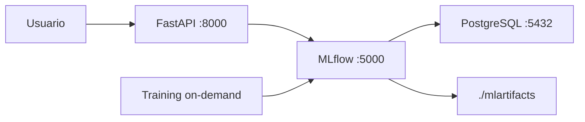

# Arquitetura de Deploy - Telco Churn Prediction

Data: 2026-05-03
Versao: 2.0
Status: Deploy em nuvem pendente

## Resumo Executivo

- O projeto possui deploy **local funcional** via Docker Compose (API + MLflow + PostgreSQL + training job).

## Estado Atual (Implementado)

## Observacao de Governanca

Os experimentos foram salvos no MLflow durante os estudos.
Os artefatos de experimento nao foram comitados no Git para manter o repositorio limpo.
