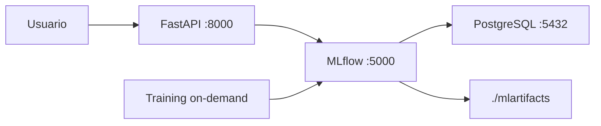
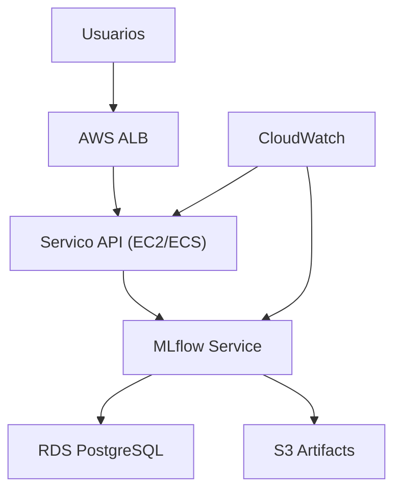

# Arquitetura de Deploy - Telco Churn Prediction

Data: 2026-05-03
Versao: 2.0
Status: Deploy em nuvem pendente

## Resumo Executivo

- O projeto possui deploy **local funcional** via Docker Compose (API + MLflow + PostgreSQL + training job).
- Havia plano de deploy em AWS (ALB, EC2/ECS, RDS, S3, CloudWatch), mas a deadline foi curta.
- Por isso, o deploy AWS **ficou pendente** nesta entrega.

## Estado Atual (Implementado)

## Plano de Deploy em AWS (Pendente)

## Motivo do Pendente

O plano AWS foi definido tecnicamente, mas nao foi finalizado por restricao de prazo da entrega.

## Escopo AWS que ficou para proxima fase

1. Provisionamento de infraestrutura (IaC).
2. Publicacao da API em endpoint publico.
3. Configuracao de observabilidade e alertas em nuvem.
4. Ajustes de seguranca (segredos, politicas de acesso, TLS, redes).
5. Validacao de custo e performance em ambiente cloud.

## Observacao de Governanca

Os experimentos foram salvos no MLflow durante os estudos.
Os artefatos de experimento nao foram comitados no Git para manter o repositorio limpo.
