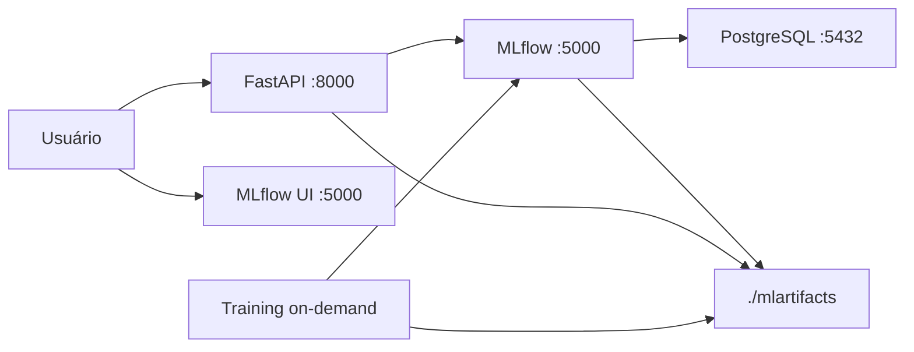
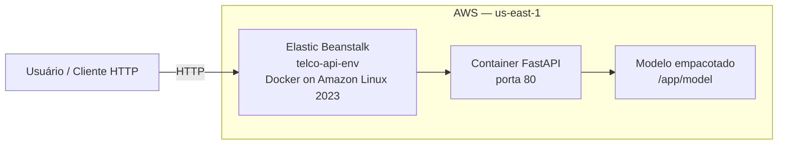

# Arquitetura de Deploy - Telco Churn Prediction

Data: 2026-05-04
Versão: 3.0
Status: Deploy local e em nuvem implementados

## Resumo Executivo

O projeto possui dois ambientes de deploy funcionais:

| Ambiente | Tecnologia | Status |
|---|---|---|
| Local | Docker Compose (API + MLflow + PostgreSQL) | Implementado |
| Nuvem | AWS Elastic Beanstalk (Docker single-container) | Implementado |

Endpoint público AWS: `http://telco-api-env.eba-23kf5mjw.us-east-1.elasticbeanstalk.com`

**Endpoints principais:**
- Health Check: `http://telco-api-env.eba-23kf5mjw.us-east-1.elasticbeanstalk.com/api/health`
- Documentação Swagger: `http://telco-api-env.eba-23kf5mjw.us-east-1.elasticbeanstalk.com/api/docs`
- Predição: `http://telco-api-env.eba-23kf5mjw.us-east-1.elasticbeanstalk.com/api/predict`

---

## 1. Deploy Local — Docker Compose

A stack local orquestra quatro serviços na mesma rede interna `mlflow_network`.



### Serviços

| Serviço | Imagem/Dockerfile | Porta | Função |
|---|---|---|---|
| `db` | `postgres:15-alpine` | 5432 | Backend de tracking do MLflow |
| `mlflow` | `Dockerfile.mlflow` | 5000 | Servidor MLflow + Model Registry |
| `api` | `Dockerfile.api` | 8000 | FastAPI de inferência |
| `training` | `Dockerfile.training` | — | Job de treinamento on-demand |

### Como executar

```bash
docker-compose up -d
docker-compose run --rm training
```

---

## 2. Deploy em Nuvem — AWS Elastic Beanstalk

A API sobe de forma **standalone** no Elastic Beanstalk, sem dependência de MLflow externo.
O modelo sklearn é empacotado dentro da própria imagem Docker.



### Decisão de arquitetura: modelo local vs. MLflow remoto

A classe `ModelManager` em `src/api/model_utils.py` implementa dois modos de carregamento, com prioridade para o local:

```
1. LOCAL_MODEL_PATH definida → carrega artefato MLflow do filesystem
2. LOCAL_MODEL_PATH ausente  → conecta ao MLFLOW_TRACKING_URI (modo Compose)
```

Isso permite reutilizar o mesmo código-fonte nos dois ambientes sem modificação.

### Arquivos de deploy

| Arquivo | Descrição |
|---|---|
| `Dockerfile.beanstalk.api` | Dockerfile standalone para o Beanstalk: porta 80, modelo copiado para `/app/model`, sem MLflow externo |
| `scripts/build_eb_api_bundle.sh` | Gera `dist/elastic_beanstalk_api.zip` com `Dockerfile`, `src/api/` e o artefato de modelo |
| `src/api/model_utils.py` | Fallback `_load_from_local_path()` via variável `LOCAL_MODEL_PATH` |

### Variáveis de ambiente no container Beanstalk

| Variável | Valor | Descrição |
|---|---|---|
| `LOCAL_MODEL_PATH` | `/app/model` | Caminho do artefato MLflow empacotado |
| `PYTHONUNBUFFERED` | `1` | Logs em tempo real |

### Estrutura do bundle de deploy

```
elastic_beanstalk_api.zip
├── Dockerfile          ← gerado a partir de Dockerfile.beanstalk.api
├── pyproject.toml
├── src/
│   └── api/            ← código da FastAPI
└── model/              ← artefato MLflow (MLmodel, model.pkl, etc.)
```

### Como gerar um novo bundle e fazer deploy

```bash
# 1. Treinar localmente e registrar novo modelo
docker-compose up -d
docker-compose run --rm training

# 2. Gerar o ZIP de deploy (descoberta automática do artefato mais recente)
sh scripts/build_eb_api_bundle.sh

# 3. Upload no console AWS
# Elastic Beanstalk → Telco-api-env → Upload and deploy → dist/elastic_beanstalk_api.zip
```

### Teste de Predição via AWS

Após o deploy bem-sucedido, teste a predição diretamente via curl:

```bash
curl -X POST http://telco-api-env.eba-23kf5mjw.us-east-1.elasticbeanstalk.com/api/predict \
  -H "Content-Type: application/json" \
  -d '{
    "features": {
      "gender": "Male",
      "senior_citizen": "No",
      "partner": "No",
      "dependents": "No",
      "tenure_months": 2,
      "phone_service": "Yes",
      "multiple_lines": "No",
      "internet_service": "DSL",
      "online_security": "No",
      "online_backup": "No",
      "device_protection": "No",
      "tech_support": "No",
      "streaming_tv": "No",
      "streaming_movies": "No",
      "contract": "Month-to-month",
      "paperless_billing": "Yes",
      "payment_method": "Mailed check",
      "monthly_charges": 53.85,
      "total_charges": 108.15
    },
    "return_probability": true
  }'
```

**Resposta esperada:**

```json
{
    "prediction": 1,
    "probability": 0.6607840845778465,
    "confidence": 0.6607840845778465,
    "processing_time_ms": 13.441801071166992
}
```


---

## 3. Comparativo dos ambientes

| Aspecto | Local (Compose) | Nuvem (Beanstalk) |
|---|---|---|
| MLflow | Serviço dedicado `:5000` | Não utilizado em runtime |
| Carregamento do modelo | Via `MLFLOW_TRACKING_URI` | Via `LOCAL_MODEL_PATH` |
| Porta da API | 8000 | 80 |
| Dockerfile | `Dockerfile.api` | `Dockerfile.beanstalk.api` |
| Escala | Single host | Gerenciado pela AWS |

---

## 4. Observação de Governança

Os artefatos de experimento MLflow (`mlartifacts/`) não são comitados no repositório Git.
Para o deploy em nuvem, o artefato é empacotado no ZIP pelo script `build_eb_api_bundle.sh` a partir da pasta local.
