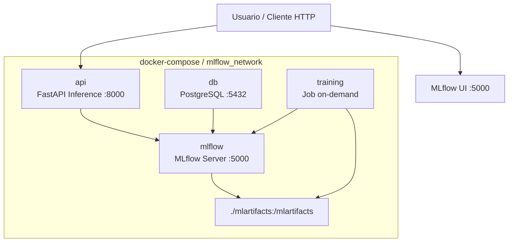
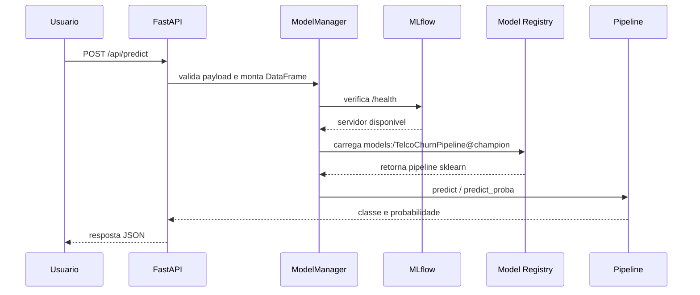

# Arquitetura Docker Implementada

## Visao Geral

A stack local do projeto roda com `docker-compose` e quatro servicos:

- `db` (PostgreSQL) para backend store do MLflow
- `mlflow` para tracking, registry e artifacts
- `api` (FastAPI) para inferencia
- `training` (on-demand) para treino e registro de modelos

## Diagrama da Arquitetura Docker



## Fluxo Final de Predicao



## Comandos Essenciais

```bash
docker-compose up -d
docker-compose run --rm training
docker-compose logs -f api
```

## Nota

Os experimentos foram salvos no MLflow, mas os artefatos de experimento nao foram comitados no Git para manter o repositorio limpo.
