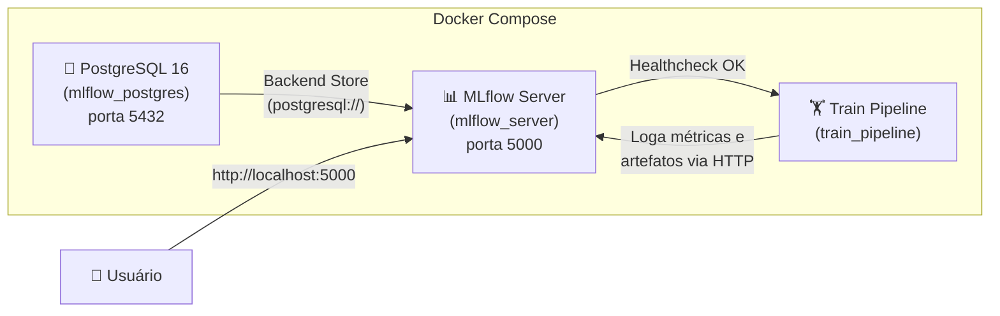

# 🐳 Como Rodar Este Projeto Localmente com Docker

Guia completo para executar o ecossistema de treino e rastreamento de experimentos localmente usando Docker e Docker Compose.

---

## Pré-requisitos

Antes de começar, certifique-se de ter instalado:

| Ferramenta         | Versão Mínima | Verificação                   |
|--------------------|---------------|-------------------------------|
| Docker             | 20.x          | `docker --version`            |
| Docker Compose     | 2.x           | `docker compose version`      |
| Git                | 2.x           | `git --version`               |

> [!NOTE]
> Não é necessário instalar Python, Poetry ou qualquer dependência local — tudo será resolvido dentro dos containers Docker.

---

## Arquitetura Local (Docker Compose)

O arquivo `docker-compose.yml` orquestra **3 serviços** que trabalham juntos:



| Serviço    | Container          | Descrição                                                                 |
|------------|--------------------|---------------------------------------------------------------------------|
| `db`       | `mlflow_postgres`  | Banco PostgreSQL 16 Alpine que persiste os metadados do MLflow.           |
| `mlflow`   | `mlflow_server`    | Servidor MLflow (UI + API) na porta 5000, conectado ao PostgreSQL.        |
| `train`    | `train_pipeline`   | Container de treino que executa o pipeline de recomendação neural (NCF).  |

---

## Passo a Passo

### 1. Clonar o Repositório

```bash
git clone https://github.com/GusdPaula/MLENG_FIAP.git
cd MLENG_FIAP/fase_2
```

### 2. Configurar Variáveis de Ambiente

Copie o arquivo de exemplo e ajuste para uso local:

```bash
cp .env.example .env
```

Edite o `.env` para apontar o MLflow para o servidor local:

```dotenv
# Para uso LOCAL com Docker Compose, use:
MLFLOW_TRACKING_URI=http://localhost:5000
```

> [!TIP]
> O arquivo `.env` é ignorado pelo Git (`.gitignore`) e pelo Docker (`.dockerignore`). As variáveis de ambiente do container de treino são definidas diretamente no `docker-compose.yml` via `environment`.

### 3. Garantir que os Dados Existam

O container de treino espera encontrar os dados brutos montados via volume. Certifique-se de que o arquivo `events.csv` exista em:

```
fase_2/ecommerce_recommender/data/raw/events.csv
```

Se os dados ainda não estiverem presentes, você pode baixá-los via DVC (requer AWS CLI configurado):

```bash
# (Fora do Docker, se tiver Python + DVC instalados)
dvc pull
```

Ou baixe manualmente do bucket S3 público:

```bash
aws s3 cp s3://fiap-ml-dvc-bucket-tech-challenger/files/md5/ ecommerce_recommender/data/raw/ --recursive --no-sign-request
```

> [!IMPORTANT]
> Sem o dataset `events.csv` na pasta `data/raw/`, o pipeline de treino falhará ao iniciar.

### 4. Build e Execução de Todos os Serviços

Execute o comando abaixo a partir do diretório `fase_2/`:

```bash
docker compose up --build
```

O que acontece internamente:
1. **PostgreSQL** sobe e fica disponível via healthcheck (`pg_isready`).
2. **MLflow Server** inicia após o Postgres estar saudável, conectando-se via `postgresql://mlflow_user:mlflow_password@db:5432/mlflow_db`.
3. **Train Pipeline** aguarda o MLflow estar saudável (`/health` endpoint) e então executa o pipeline de treino completo.

> [!NOTE]
> O primeiro build pode demorar alguns minutos para instalar todas as dependências Python no stage `builder` do Dockerfile multi-stage.

### 5. Acessar a Interface do MLflow

Abra o navegador e acesse:

🔗 **[http://localhost:5000](http://localhost:5000)**

Você poderá visualizar:
- **Experiments**: O experimento `ecommerce_recommender_fiap` com os runs registrados.
- **Métricas**: `ndcg_at_10`, `hit_rate_at_10`, `auc_roc`, `avg_precision`, entre outras.
- **Parâmetros**: Hiperparâmetros do modelo NCF (embedding_dim, hidden_layers, dropout, etc.).
- **Model Registry**: Modelos registrados com aliases `staging` e `production`.

---

## Comandos Úteis

### Executar em segundo plano (detached)

```bash
docker compose up --build -d
```

### Acompanhar logs em tempo real

```bash
# Todos os serviços
docker compose logs -f

# Apenas o treino
docker compose logs -f train

# Apenas o MLflow
docker compose logs -f mlflow
```

### Parar todos os serviços

```bash
docker compose down
```

### Parar e remover volumes (limpar banco de dados)

```bash
docker compose down -v
```

> [!CAUTION]
> O comando `docker compose down -v` **apaga permanentemente** todos os dados do PostgreSQL e artefatos do MLflow armazenados nos volumes Docker.

### Reconstruir apenas um serviço específico

```bash
docker compose build train
docker compose up train
```

---

## Detalhes Técnicos dos Dockerfiles

### `Dockerfile` (Pipeline de Treino) — Multi-stage

```
┌─────────────────────────────────────────────────┐
│  Stage 1: builder (python:3.12-slim)            │
│  ├─ Instala build-essential                     │
│  ├─ Instala Poetry >= 2.0.0                     │
│  └─ Executa poetry install --only main --no-root│
├─────────────────────────────────────────────────┤
│  Stage 2: runtime (python:3.12-slim)            │
│  ├─ Copia .venv do builder                      │
│  ├─ Copia código da aplicação                   │
│  ├─ Define PYTHONPATH para o src                │
│  └─ CMD: python -m recommender.pipelines...     │
└─────────────────────────────────────────────────┘
```

### `Dockerfile.mlflow` (Servidor MLflow)

Imagem simples baseada em `python:3.12-slim` com:
- `mlflow >= 3.0.0`
- `psycopg2-binary` (driver PostgreSQL)
- `boto3` (para armazenamento S3)

---

## Volumes Persistentes

| Volume Docker       | Caminho no Container           | Descrição                                    |
|----------------------|--------------------------------|----------------------------------------------|
| `postgres_data`      | `/var/lib/postgresql/data`     | Dados do banco PostgreSQL do MLflow          |
| `mlflow_artifacts`   | `/mlflow-artifacts`            | Artefatos de modelos logados no MLflow       |
| *(bind mount)* `data`   | `/app/ecommerce_recommender/data`    | Dados brutos e processados do pipeline |
| *(bind mount)* `models` | `/app/ecommerce_recommender/models`  | Checkpoints de modelo salvos          |
| *(bind mount)* `configs`| `/app/ecommerce_recommender/configs` | Arquivos de configuração YAML         |

---

## Troubleshooting

| Problema | Solução |
|----------|---------|
| `port 5432 already in use` | Pare qualquer PostgreSQL local: `sudo systemctl stop postgresql` |
| `port 5000 already in use` | Pare qualquer processo na porta 5000 ou altere o mapeamento no `docker-compose.yml` |
| Container `train` falha com `FileNotFoundError` | Certifique-se de que `ecommerce_recommender/data/raw/events.csv` existe |
| Build lento na primeira vez | Normal — o Poetry resolve e baixa ~700MB+ de dependências (PyTorch, etc.) |
| MLflow UI vazia | Aguarde o container `train` finalizar sua execução para ver os runs registrados |
