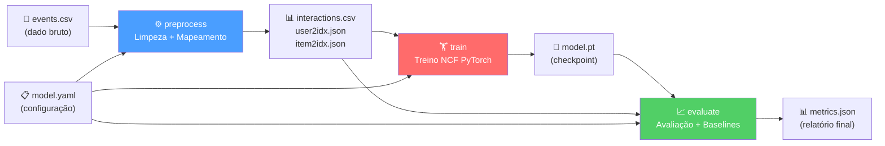

# 🔁 Como Rodar a Pipeline de Treino Usando o DVC (End-to-End)

Guia completo para reproduzir todo o pipeline de Machine Learning — do dado bruto até a avaliação e registro do modelo — utilizando o DVC (Data Version Control).

---

## Visão Geral do Pipeline

O pipeline DVC é composto por **3 estágios** encadeados, definidos no arquivo `dvc.yaml`:



| Estágio        | Entrada                                      | Saída                                         | Descrição |
|----------------|----------------------------------------------|-----------------------------------------------|-----------|
| `preprocess`   | `data/raw/events.csv`, `configs/model.yaml`  | `data/processed/interactions.csv`, `user2idx.json`, `item2idx.json` | Limpa eventos, filtra interações mínimas e cria mapeamentos user/item → índice numérico. |
| `train`        | Dados processados, `configs/model.yaml`      | `models/model.pt`                              | Treina o modelo Neural Collaborative Filtering (NCF) com PyTorch. |
| `evaluate`     | `models/model.pt`, dados processados, config | `reports/metrics.json`                         | Avalia o modelo contra baselines (Popularidade, Regressão Logística) usando métricas como NDCG@10, Hit Rate@10, AUC-ROC, etc. |

---

## Pré-requisitos

| Ferramenta       | Versão Mínima | Instalação/Verificação                         |
|------------------|---------------|------------------------------------------------|
| Python           | 3.12          | `python --version`                             |
| Poetry           | 2.0.0         | `poetry --version`                             |
| DVC              | 3.67.1        | `dvc --version` (instalado via Poetry)         |
| AWS CLI          | 2.x           | `aws --version` (para `dvc pull` do S3 remoto) |
| Git              | 2.x           | `git --version`                                |

---

## Passo a Passo Completo

### 1. Instalar as Dependências

A partir do diretório `fase_2/`:

```bash
cd fase_2
poetry install
```

Isso instala todas as dependências de produção e desenvolvimento, incluindo o DVC com suporte a S3 (`dvc[s3]`).

### 2. Configurar Variáveis de Ambiente

```bash
cp .env.example .env
```

Edite o `.env` conforme necessário:

```dotenv
# Para uso local com SQLite (sem servidor MLflow rodando)
MLFLOW_TRACKING_URI=sqlite:///mlflow.db

# Para uso com Docker Compose local
# MLFLOW_TRACKING_URI=http://localhost:5000

# Para uso com servidor AWS (produção)
# MLFLOW_TRACKING_URI=https://mlflow.asgardprint.com.br

AWS_DEFAULT_REGION=us-east-1
AWS_REGION=us-east-1
AWS_PROFILE=aws
```

> [!TIP]
> Se estiver usando o MLflow local via SQLite, o banco é criado automaticamente em `ecommerce_recommender/mlflow.db`. Não precisa de nenhum servidor rodando.

### 3. Configurar Credenciais AWS (para DVC remoto)

O DVC usa um bucket S3 como armazenamento remoto. Configure suas credenciais:

```bash
aws configure --profile aws
```

Preencha com:
- **AWS Access Key ID**: sua chave de acesso
- **AWS Secret Access Key**: sua chave secreta
- **Default region**: `us-east-1`
- **Output format**: `json`

> [!NOTE]
> O bucket S3 `fiap-ml-dvc-bucket-tech-challenger` possui política de **leitura pública**. Para fazer `dvc pull` (download), credenciais mínimas são suficientes. Para `dvc push` (upload), são necessárias permissões de escrita via o usuário IAM `fiap-dvc-user`.

### 4. Baixar os Dados do Remoto (dvc pull)

```bash
dvc pull
```

Isso sincroniza os seguintes arquivos do bucket S3 para o repositório local:

```
ecommerce_recommender/data/raw/events.csv         (~90 MB)
ecommerce_recommender/data/processed/interactions.csv
ecommerce_recommender/data/processed/user2idx.json
ecommerce_recommender/data/processed/item2idx.json
ecommerce_recommender/models/model.pt              (~39 MB)
```

> [!IMPORTANT]
> Sem o `dvc pull`, os arquivos de dados e modelos **não existem** no repositório (estão no `.gitignore`), e qualquer estágio do pipeline irá falhar.

### 5. Reproduzir o Pipeline Completo (dvc repro)

```bash
dvc repro
```

O DVC verifica os hashes de todas as dependências e só re-executa os estágios cujas entradas mudaram. Na primeira execução (ou se quiser forçar), todos os 3 estágios serão executados na ordem:

```
Running stage 'preprocess':
> poetry run python -c "import sys; sys.path.insert(0, 'src'); ..."

Running stage 'train':
> poetry run python -c "import sys; sys.path.insert(0, 'src'); ..."

Running stage 'evaluate':
> poetry run python -c "import sys; sys.path.insert(0, 'src'); ..."
```

### 6. Verificar as Métricas Geradas

Após a execução, o arquivo de métricas é gerado em:

```bash
cat ecommerce_recommender/reports/metrics.json
```

Você também pode usar o comando nativo do DVC:

```bash
dvc metrics show
```

### 7. (Opcional) Enviar Resultados de Volta ao Remoto

Se houve mudanças nos dados ou modelos e você deseja persistir no S3:

```bash
dvc push
```

---

## Configuração do Pipeline (`dvc.yaml`)

O arquivo `dvc.yaml` na raiz do `fase_2/` define a estrutura completa:

```yaml
stages:
  preprocess:
    cmd: poetry run python -c "..."
    wdir: ecommerce_recommender       # Diretório de trabalho
    deps:
      - data/raw/events.csv           # Dado bruto
      - configs/model.yaml            # Configuração
    params:                            # Parâmetros rastreados
      - configs/model.yaml:
        - model.processor             # Estratégia de processamento (weighted/binary/implicit)
        - model.min_interactions      # Mínimo de interações por usuário
    outs:
      - data/processed/interactions.csv
      - data/processed/user2idx.json
      - data/processed/item2idx.json

  train:
    cmd: poetry run python -c "..."
    wdir: ecommerce_recommender
    deps:
      - data/processed/*              # Saídas do estágio anterior
      - configs/model.yaml
    params:
      - configs/model.yaml:
        - model.type                  # Tipo do modelo (ncf, gmf, matrix_factorization)
        - model.seed                  # Seed para reprodutibilidade
        - model.batch_size            # Tamanho do batch (1024)
        - model.learning_rate         # Taxa de aprendizado (0.001)
        - model.epochs                # Número de épocas (1)
        - model.num_negatives         # Amostras negativas por positiva (4)
        - model.hyperparams           # embedding_dim, hidden_layers, dropout
    outs:
      - models/model.pt               # Checkpoint do modelo treinado

  evaluate:
    cmd: poetry run python -c "..."
    wdir: ecommerce_recommender
    deps:
      - models/model.pt
      - data/processed/*
      - configs/model.yaml
    metrics:
      - reports/metrics.json:
          cache: false                 # Sempre re-calcular métricas
```

---

## Parâmetros Configuráveis (`configs/model.yaml`)

Os parâmetros mais relevantes que impactam o pipeline:

| Parâmetro                  | Valor Padrão          | Descrição                                         |
|----------------------------|-----------------------|-----------------------------------------------------|
| `model.type`               | `ncf`                 | Modelo a treinar: `ncf`, `gmf`, `matrix_factorization` |
| `model.processor`          | `weighted`            | Estratégia de processamento: `weighted`, `binary`, `implicit` |
| `model.seed`               | `42`                  | Seed global para reprodutibilidade                   |
| `model.batch_size`         | `1024`                | Tamanho do mini-batch para treino                    |
| `model.learning_rate`      | `0.001`               | Taxa de aprendizado do otimizador                    |
| `model.epochs`             | `1`                   | Número de épocas de treino                           |
| `model.num_negatives`      | `4`                   | Amostras negativas por interação positiva            |
| `model.min_interactions`   | `5`                   | Mínimo de interações para manter um usuário          |
| `model.hyperparams.embedding_dim`  | `64`          | Dimensão dos embeddings user/item                    |
| `model.hyperparams.hidden_layers`  | `[128, 64, 32]` | Camadas ocultas da MLP do NCF                      |
| `model.hyperparams.dropout`        | `0.2`          | Taxa de dropout na MLP                              |
| `model.early_stopping.enabled`     | `true`         | Habilitar early stopping                            |
| `model.early_stopping.monitor`     | `ndcg_at_k`    | Métrica monitorada para parar                       |
| `model.early_stopping.patience`    | `3`            | Épocas sem melhora antes de parar                   |

> [!TIP]
> Para alterar parâmetros e re-executar apenas os estágios afetados, edite `configs/model.yaml` e rode `dvc repro`. O DVC recalcula automaticamente quais estágios precisam ser re-executados com base no grafo de dependências.

---

## Configuração do DVC Remoto

O DVC está configurado com um remoto S3 no arquivo `.dvc/config`:

```ini
[core]
    analytics = false
    remote = s3-public
    autostage = true

['remote "s3-public"']
    url = s3://fiap-ml-dvc-bucket-tech-challenger
    profile = aws
```

- **`remote = s3-public`**: Define o remoto padrão.
- **`url`**: Aponta para o bucket S3 na AWS.
- **`profile = aws`**: Usa o perfil `aws` do AWS CLI para autenticação.
- **`autostage = true`**: Adiciona automaticamente os `.dvc` files ao `git add` após `dvc push/pull`.

---

## Executar Estágios Individuais

Caso queira executar apenas um estágio específico:

```bash
# Apenas o pré-processamento
dvc repro preprocess

# Apenas o treino (requer que preprocess já tenha rodado)
dvc repro train

# Apenas a avaliação (requer que train já tenha rodado)
dvc repro evaluate
```

---

## Forçar Re-execução (Ignorar Cache)

Para forçar a re-execução de todo o pipeline, mesmo sem mudanças nas dependências:

```bash
dvc repro --force
```

---

## Visualizar o Grafo de Dependências

```bash
dvc dag
```

Saída esperada:

```
+-----------+
| preprocess |
+-----------+
      *
      *
      *
  +-------+
  | train  |
  +-------+
      *
      *
      *
 +----------+
 | evaluate |
 +----------+
```

---

## Integração com MLflow

Durante a execução do pipeline, cada estágio automaticamente registra informações no MLflow:

- **`preprocess`**: Registra parâmetros de processamento.
- **`train`**: Loga métricas de treino (loss por época), parâmetros do modelo, e salva o checkpoint no Model Registry.
- **`evaluate`**: Loga métricas comparativas contra baselines (Popularidade, Regressão Logística) e atualiza o alias `staging` se o modelo superar o anterior.

> [!NOTE]
> O MLflow Tracking URI é determinado pela variável de ambiente `MLFLOW_TRACKING_URI`. Se não houver servidor rodando, use `sqlite:///mlflow.db` para registro local em arquivo.

---

## Troubleshooting

| Problema | Solução |
|----------|---------|
| `ERROR: failed to pull data from remote` | Verifique as credenciais AWS: `aws sts get-caller-identity --profile aws` |
| `FileNotFoundError: events.csv` | Execute `dvc pull` antes de rodar `dvc repro` |
| `Stage 'preprocess' didn't change, skipping` | Normal — o DVC detectou que as entradas não mudaram. Use `--force` para forçar. |
| `CUDA not available, using CPU` | Esperado se não houver GPU. O treino roda normalmente em CPU (mais lento). |
| `Connection refused` para MLflow | Verifique se o `MLFLOW_TRACKING_URI` aponta para um servidor acessível ou use `sqlite:///mlflow.db` |
| `dvc push` falha com `AccessDenied` | Você precisa de permissões de escrita no bucket S3. Verifique se o usuário IAM tem a política `DVC-Bucket-ReadWrite-Policy`. |
