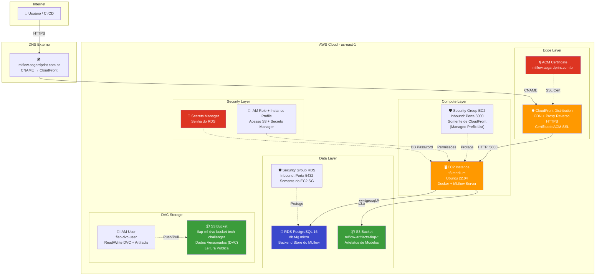
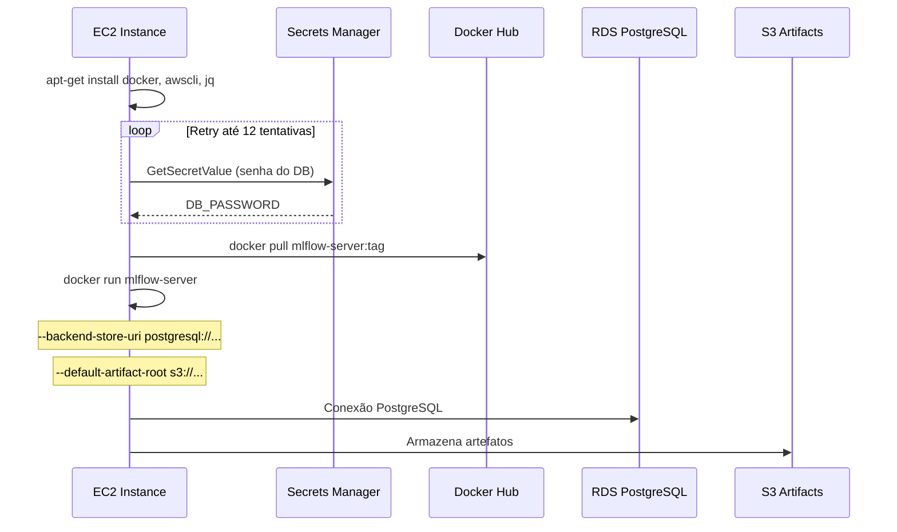
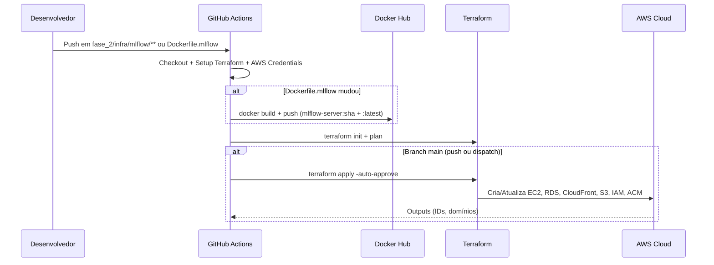
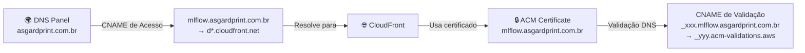

# ☁️ Infraestrutura AWS para o MLflow

Documentação completa da infraestrutura de nuvem provisionada na AWS via Terraform para hospedar o servidor MLflow do projeto, incluindo o desenho de arquitetura, componentes, automações de CI/CD e URL de acesso.

---

## URL de Acesso

| Ambiente   | URL                                          | Descrição                                    |
|------------|----------------------------------------------|----------------------------------------------|
| Produção   | **https://mlflow.asgardprint.com.br**        | Domínio personalizado via CloudFront + ACM   |
| Fallback   | `https://d*.cloudfront.net`                   | URL padrão do CloudFront (se domínio indisponível) |

> [!IMPORTANT]
> O servidor MLflow na AWS é gerenciado via GitHub Actions e pode estar **desligado** para economia de custos. Consulte a seção [Gerenciamento Liga/Desliga](#gerenciamento-ligadesliga-via-github-actions) para instruções de como iniciar.

---

## Desenho de Arquitetura



---

## Componentes da Infraestrutura

### 1. CloudFront Distribution (CDN + Proxy Reverso)

| Propriedade              | Valor                                       |
|--------------------------|---------------------------------------------|
| **Tipo**                 | Distribuição CloudFront                     |
| **Função**               | Proxy reverso HTTPS na frente da EC2        |
| **Alias (domínio)**      | `mlflow.asgardprint.com.br`                 |
| **Protocolo de Origem**  | HTTP-only (porta 5000)                      |
| **Protocolo do Viewer**  | Redirect HTTP → HTTPS                       |
| **Cache**                | Desabilitado (TTL = 0 para todas as requests) |
| **Métodos permitidos**   | GET, HEAD, OPTIONS, POST, PUT, PATCH, DELETE |
| **Certificado SSL**      | ACM Certificate (TLS 1.2+, SNI-only)       |

> [!NOTE]
> O cache está desabilitado (`min_ttl = 0`, `default_ttl = 0`, `max_ttl = 0`) porque o MLflow é uma aplicação dinâmica que requer dados em tempo real. O CloudFront atua apenas como terminador SSL e camada de segurança.

### 2. EC2 Instance (Compute)

| Propriedade              | Valor                                       |
|--------------------------|---------------------------------------------|
| **Instance Type**        | `t3.medium`                                 |
| **AMI**                  | Ubuntu 22.04 LTS (Canonical)                |
| **Security Group**       | Aceita tráfego **somente de CloudFront** via AWS Managed Prefix List |
| **IP Público**           | Sim (associado automaticamente)             |
| **IAM Instance Profile** | Role com acesso a S3 (artefatos) e Secrets Manager |
| **User Data**            | Script bash que instala Docker, busca a senha do RDS no Secrets Manager e inicia o container MLflow |

**Fluxo de inicialização da EC2 (User Data):**



### 3. RDS PostgreSQL (Backend Store)

| Propriedade              | Valor                                       |
|--------------------------|---------------------------------------------|
| **Engine**               | PostgreSQL 16.3                             |
| **Instance Class**       | `db.t4g.micro` (otimizado para custo)       |
| **Storage**              | 20 GB                                       |
| **Database Name**        | `mlflow`                                    |
| **Username**             | `mlflow_user`                               |
| **Password**             | Gerenciada pelo Secrets Manager             |
| **Acesso Público**       | ❌ Não (subnet privada)                      |
| **Security Group**       | Aceita conexões apenas do Security Group da EC2 na porta 5432 |

### 4. S3 Buckets

#### Bucket de Artefatos MLflow

| Propriedade              | Valor                                       |
|--------------------------|---------------------------------------------|
| **Nome**                 | `mlflow-artifacts-fiap-rsnnnlwu`            |
| **Função**               | Armazenar modelos, plots e artefatos logados no MLflow |
| **Acesso**               | Privado (somente via IAM Role da EC2 e IAM User DVC) |
| **Force Destroy**        | Habilitado                                  |

#### Bucket DVC (Dados Versionados)

| Propriedade              | Valor                                       |
|--------------------------|---------------------------------------------|
| **Nome**                 | `fiap-ml-dvc-bucket-tech-challenger`        |
| **Função**               | Armazenar datasets e modelos versionados pelo DVC |
| **Acesso de Leitura**    | ✅ Público (política `s3:GetObject` + `s3:ListBucket` para `*`) |
| **Acesso de Escrita**    | Restrito ao IAM User `fiap-dvc-user`        |

### 5. Segurança

| Componente                | Detalhes                                                                 |
|---------------------------|--------------------------------------------------------------------------|
| **Secrets Manager**       | Armazena a senha do RDS gerada aleatoriamente (16 caracteres, com especiais) |
| **IAM Role (EC2)**        | Permite `s3:ListBucket`, `s3:GetObject`, `s3:PutObject`, `s3:DeleteObject` no bucket de artefatos + `secretsmanager:GetSecretValue` para a senha do DB |
| **IAM Policy (SSM)**      | `AmazonSSMManagedInstanceCore` para acesso via AWS Systems Manager       |
| **IAM User (DVC)**        | `fiap-dvc-user` com política de R/W em ambos os buckets S3              |
| **Security Group (EC2)**  | Inbound na porta 5000 **somente** da prefix list gerenciada do CloudFront |
| **Security Group (RDS)**  | Inbound na porta 5432 **somente** do Security Group da EC2              |
| **ACM Certificate**       | Certificado SSL para `mlflow.asgardprint.com.br` com validação DNS      |

---

## Terraform: Módulos e State

A infraestrutura está organizada em **2 módulos Terraform independentes**:

```
fase_2/infra/
├── mlflow/              # Módulo do servidor MLflow
│   ├── main.tf          # Recursos: EC2, RDS, CloudFront, S3, IAM, ACM, SGs
│   ├── variables.tf     # Variáveis de entrada
│   └── outputs.tf       # Outputs: IDs, domínios, validação ACM
│
└── s3/                  # Módulo do bucket DVC
    ├── main.tf          # Recursos: S3 Bucket, IAM User, IAM Policy
    ├── variables.tf     # Variáveis de entrada
    └── outputs.tf       # Outputs: ARNs, URLs
```

Ambos usam **backend remoto S3** para armazenar o state:

| Módulo     | Bucket de State                  | Key                                        |
|------------|----------------------------------|--------------------------------------------|
| `mlflow`   | `terraform-state-mlflow-fiap`    | `fase_2/infra/mlflow/terraform.tfstate`    |
| `s3`       | `terraform-state-mlflow-fiap`    | `fase_2/infra/s3/terraform.tfstate`        |

---

## Gerenciamento Liga/Desliga via GitHub Actions

Para evitar custos desnecessários com a infraestrutura ociosa, o workflow **"Manage MLflow Server"** (`.github/workflows/manage-mlflow.yml`) automatiza o ciclo de liga/desliga:

```mermaid
graph TD
    subgraph "▶️ Action: START"
        S1["Verifica estado do RDS"] --> S2{"RDS parado?"}
        S2 -- "Sim" --> S3["Inicia RDS + Aguarda available"]
        S2 -- "Não" --> S4["Pula"]
        S3 --> S5["Verifica estado da EC2"]
        S4 --> S5
        S5 --> S6{"EC2 parada?"}
        S6 -- "Sim" --> S7["Inicia EC2 + Aguarda running"]
        S6 -- "Não" --> S8["Pula"]
        S7 --> S9["Obtém novo DNS público da EC2"]
        S8 --> S9
        S9 --> S10{"Origem do CloudFront<br/>diferente?"}
        S10 -- "Sim" --> S11["Atualiza origem do CloudFront<br/>com novo DNS"]
        S10 -- "Não" --> S12["Pula atualização"]
        S11 --> S13["Aguarda deploy do CloudFront<br/>(até 10 min)"]
        S13 --> S14["✅ MLflow acessível via HTTPS"]
        S12 --> S14
    end

    subgraph "⏹️ Action: STOP"
        P1["Para EC2 (stop-instances)"]
        P2["Para RDS (stop-db-instance)"]
        P1 --> P3["✅ Infraestrutura desligada"]
        P2 --> P3
    end

    style S14 fill:#51cf66,color:#fff
    style P3 fill:#ff6b6b,color:#fff
```



### Como usar:

1. Vá até a aba **Actions** do repositório no GitHub.
2. Selecione o workflow **"Manage MLflow Server"**.
3. Clique em **"Run workflow"**.
4. Escolha a ação:
   - **`start`** — Liga RDS + EC2 + atualiza CloudFront.
   - **`stop`** — Desliga EC2 + RDS para economizar custos.

> [!WARNING]
> Ao ligar o servidor, a EC2 recebe um **novo IP público**. O workflow automaticamente atualiza a origem do CloudFront para apontar para o novo endereço. Esse processo pode levar **até 10 minutos** (propagação do CloudFront).

---

## Workflows de CI/CD Relacionados

| Workflow                        | Arquivo                          | Trigger                          | Função                                                                                       |
|---------------------------------|----------------------------------|----------------------------------|----------------------------------------------------------------------------------------------|
| **Deploy MLflow Infrastructure**| `deploy-mlflow.yml`              | Push em `fase_2/infra/mlflow/**` ou `Dockerfile.mlflow`, ou manual | Build da imagem Docker do MLflow, push para Docker Hub e `terraform apply` do módulo mlflow. |
| **Deploy Infrastructure**       | `deploy-infra.yml`               | Push em `fase_2/infra/**` ou manual                                | `terraform apply` do módulo S3 (bucket DVC).                                                 |
| **Manage MLflow Server**        | `manage-mlflow.yml`              | Manual (`workflow_dispatch`)                                       | Liga/desliga EC2 + RDS + atualização dinâmica do CloudFront.                                 |
| **Promote Model**               | `promote-model.yml`              | Manual (`workflow_dispatch`)                                       | Promove modelo do alias `staging` para `production` no MLflow Model Registry.                |
| **Fase 2 CI**                   | `fase_2-ci.yml`                  | Push/PR em `fase_2/**`                                             | Lint (ruff) + testes unitários (pytest).                                                     |

---

## Fluxo de Deploy da Infraestrutura MLflow



---

## Domínio Personalizado (ACM + CloudFront)

O domínio `mlflow.asgardprint.com.br` utiliza um certificado SSL gerenciado pelo AWS Certificate Manager (ACM) com validação DNS:



A ativação do domínio customizado é controlada pela variável Terraform `use_custom_domain`:
- **`false`**: CloudFront usa certificado padrão (URL genérica `d*.cloudfront.net`).
- **`true`**: CloudFront associa o certificado ACM e responde no domínio personalizado.

---

## Custos Estimados (quando ligado)

| Recurso                  | Tipo               | Custo Estimado (us-east-1)    |
|--------------------------|--------------------|-----------------------------|
| EC2 (`t3.medium`)        | On-demand          | ~$0.0416/hora (~$30/mês)     |
| RDS (`db.t4g.micro`)     | On-demand          | ~$0.016/hora (~$12/mês)      |
| CloudFront               | Requests + transfer | ~$1-5/mês (uso baixo)       |
| S3 (Artifacts)           | Storage            | ~$0.023/GB/mês              |
| S3 (DVC)                 | Storage            | ~$0.023/GB/mês              |
| Secrets Manager          | Per secret         | ~$0.40/mês                   |
| ACM Certificate          | Grátis             | $0.00                        |
| **Total estimado**       |                    | **~$45-50/mês (ligado 24/7)** |

> [!TIP]
> Usando o workflow de **liga/desliga**, é possível reduzir drasticamente os custos. Se o servidor ficar ligado apenas 2-3 horas por dia, o custo de EC2 + RDS cai para aproximadamente **$5-8/mês**.
