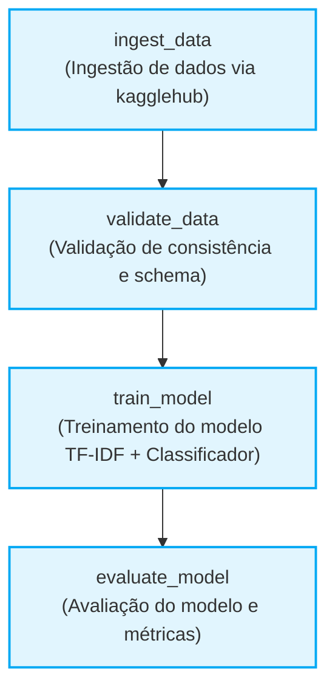

# Apache Airflow DAGs - Pipeline de Machine Learning Médica

Este diretório contém a definição da orquestração do pipeline de Machine Learning utilizando o **Apache Airflow**.

## DAG: `medical_classification_training_pipeline`

Esta DAG é responsável por orquestrar o processo completo de atualização (retreinamento) do modelo de triagem de laudos médicos de forma agendada (`@weekly`).

### Fluxo de Execução (Pipeline)

Abaixo está o diagrama do fluxo desenvolvido, representando as dependências entre cada uma das tarefas (tasks) orquestradas pelo Airflow.

### Descrição das Tasks

1. **`ingest_data`**: 
   - **Objetivo:** Faz o download e carregamento da base de dados original de abstracts médicos (via kagglehub).
   - **Módulo:** `treino_modelo.data.ingest.load_data`

2. **`validate_data`**: 
   - **Objetivo:** Inspeciona os conjuntos de treino e teste, validando o schema esperado (tipos de colunas, nomes e ausência de nulos) e consistência da distribuição de classes.
   - **Módulo:** `treino_modelo.data.validate.validate_data`

3. **`train_model`**: 
   - **Objetivo:** Instancia e treina o pipeline de NLP (tipicamente composto pela extração de features via TF-IDF e um classificador final como XGBoost ou LinearSVC) com a base de dados de treinamento e persiste o modelo na pasta designada.
   - **Módulo:** `treino_modelo.train.train.train_model`

4. **`evaluate_model`**: 
   - **Objetivo:** Carrega o modelo recém-treinado e o aplica sobre a base de testes gerando métricas de performance (acurácia, F1-score, precision, recall) e matrizes de confusão.
   - **Módulo:** `treino_modelo.train.evaluate.evaluate_model`

### Agendamento
- **Intervalo:** Semanal (`@weekly`)
- **Dependência entre tarefas:** Nenhuma tarefa subsequente inicia sem que a anterior tenha terminado com sucesso (condição de sucesso `all_success`).
